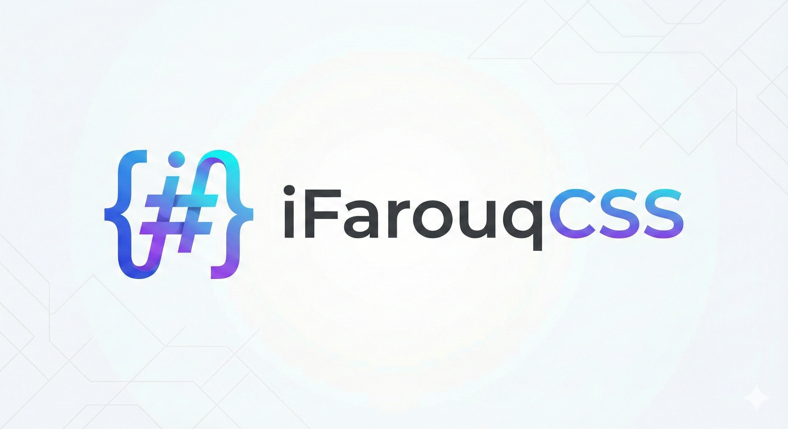

<div align="center">


# iFarouqCSS

**A Comprehensive Modern SASS Color Framework**

[](https://github.com/iFarouqDev/iFarouqCSS)
[](LICENSE)
[](https://sass-lang.com/)

**36 Color Families** • **326+ Shades** • **92 Gradients** • **Glassmorphism** • **Hover & Active States**

</div>

# iFarouq Color Framework Documentation

A comprehensive, modern SASS color framework featuring **36 color families** with **326+ color variations**, **92 stunning gradients**, and extensive utility classes including hover and active states.

**Version**: 2.1.0  
**Last Updated**: December 09th, 2025

---

## 📦 Installation

### Prerequisites
- SASS/SCSS compiler (Dart Sass recommended)
- Node.js (optional, for npm scripts)

### Setup

1. **Download/Clone** the framework files to your project 👉🏻 <a target="_blank" href="https://github.com/iFarouqDev/iFarouqCSS" class="btn-gradient-royal" style="text-decoration: none; padding: 5px;">here...</a></li>
2. **Place all SCSS files** in a `scss/` directory:
   ```
   scss/
   ├── _variables.scss
   ├── _maps.scss
   ├── _mixins.scss
   ├── _components.scss
   ├── _utilities.scss
   └── colors-framework.scss
   ```

3. **Compile the framework**:
   ```bash
   sass scss/colors-framework.scss dist/iFarouqCSS.css --style=compressed
   ```

4. **Link in your HTML**:
   ```html
   <link rel="stylesheet" href="dist/iFarouqCSS.css">
   ```

---

<h2 class="text-gradient-candy-crush">⇅ Download the Compiled file</h2>
<br>
<p>
    No need to rush with the compilation! We’ve got you covered. iFarouqCSS-v2.1.0 is all set. <a href="dist/iFarouqCSS.css.zip" download="iFarouqCSS.css.zip" type="text/css">Download</a> it now and dive right in!
</p>
<p><code class="liquid-glass-glacier-blue rounded rounded" style="padding: 15px; font-weight: bolder;">< Happy Coding 🎉👨🏻‍💻 /></code></p>

---

## 🎨 Color System

### 36 Complete Color Families

Each color family includes **9 full shades** (100-900) for maximum flexibility:

**Primary Colors:**
- **Blue** - `#0D6EFD` - Modern primary blue
- **Indigo** - `#6610F2` - Deep indigo
- **Purple** - `#6F42C1` - Royal purple
- **Pink** - `#F63384` - Vibrant pink
- **Red** - `#DC3545` - Classic red
- **Orange** - `#FD7E14` - Bright orange
- **Yellow** - `#FFC107` - Sunny yellow
- **Green** - `#198754` - Fresh green
- **Teal** - `#20C997` - Aqua teal
- **Cyan** - `#0DCAF0` - Sky cyan
- **Gray** - `#ADB5BD` - Neutral gray

**Extended Palette:**
- **Lime** - `#84CC16` - Electric lime
- **Emerald** - `#10B981` - Rich emerald
- **Sky** - `#0EA5E9` - Clear sky blue
- **Violet** - `#8B5CF6` - Deep violet
- **Fuchsia** - `#D946EF` - Bright fuchsia
- **Rose** - `#F43F5E` - Modern rose
- **Amber** - `#F59E0B` - Warm amber
- **Slate** - `#64748B` - Cool slate
- **Zinc** - `#71717A` - Modern zinc
- **Stone** - `#78716C` - Natural stone
- **Neutral** - `#737373` - Pure neutral

**Specialty Colors:**
- **Crimson** - `#DC143C` - Deep crimson
- **Coral** - `#FF7F50` - Living coral
- **Salmon** - `#FA8072` - Soft salmon
- **Gold** - `#FFD700` - Metallic gold
- **Bronze** - `#CD7F32` - Antique bronze
- **Silver** - `#C0C0C0` - Polished silver
- **Navy** - `#000080` - Classic navy
- **Maroon** - `#800000` - Rich maroon
- **Olive** - `#808000` - Natural olive
- **Mint** - `#98FF98` - Fresh mint
- **Lavender** - `#E6E6FA` - Soft lavender
- **Peach** - `#FFDAB9` - Sweet peach
- **Turquoise** - `#40E0D0` - Tropical turquoise
- **Aquamarine** - `#7FFFD4` - Ocean aquamarine

Plus **Black** (`#000`) and **White** (`#FFF`)

### Color Shade System

Each color family follows a consistent 9-shade system:

| Shade | Lightness | Use Case |
|-------|-----------|----------|
| `100` | Lightest | Backgrounds, subtle accents |
| `200` | Very Light | Hover states, highlights |
| `300` | Light | Secondary backgrounds |
| `400` | Medium Light | Borders, dividers |
| `500` | **Base** | Primary color (same as color name) |
| `600` | Medium Dark | Hover states, emphasis |
| `700` | Dark | Text on light backgrounds |
| `800` | Very Dark | Primary text, strong emphasis |
| `900` | Darkest | Headers, maximum contrast |

---

## 🌈 Gradient Collection - 92 Total Gradients!

### Original Collection (50 Gradients)

**Vibrant & Modern:**
- `aurora-dream` - Purple to pink aurora
- `ocean-bliss` - Cyan to blue ocean
- `sunset-glory` - Red to yellow sunset
- `emerald-flow` - Teal to green flow
- `royal-purple` - Purple to magenta
- `cyber-blue` - Electric blue cyber
- `peachy-paradise` - Peach to pink paradise
- `mint-breeze` - Mint green breeze
- `crimson-tide` - Red to pink wave
- `golden-hour` - Yellow to orange glow
- `lavender-haze` - Lavender to purple
- `tropical-storm` - Cyan to teal storm
- `cherry-blossom` - Soft pink cherry
- `deep-space` - Dark blue space
- `neon-nights` - Hot pink to orange neon
- `aqua-marine` - Bright cyan aquatic
- `fire-opal` - Red to yellow fire
- `purple-haze` - Purple psychedelic
- `rose-gold` - Rose to gold elegance
- `electric-lime` - Lime to cyan electric
- `cosmic-fusion` - Magenta to purple cosmic
- `tangerine-dream` - Orange tangerine
- `mystic-violet` - Purple to violet mystic
- `turquoise-wave` - Turquoise wave

**Sophisticated:**
- `moonlight-serenade` - Blue to black night
- `candy-crush` - Pink to blue candy
- `rainbow-sherbet` - Pink to yellow rainbow
- `northern-lights` - Green to blue aurora
- `desert-mirage` - Yellow to orange desert
- `glacier-blue` - Light blue glacier
- `velvet-night` - Dark purple velvet
- `strawberry-lemonade` - Cream to pink
- `emerald-dream` - Bright green dream
- `blueberry-muffin` - Purple blueberry
- `phoenix-fire` - Red to yellow phoenix
- `tropical-paradise` - Pink to cyan tropical
- `midnight-city` - Gray to black city
- `cotton-candy` - Pink to blue candy
- `volcanic-ash` - Gray to blue volcanic
- `honey-dew` - Yellow to pink honey
- `arctic-frost` - Green to cyan frost
- `ruby-red` - Deep red ruby
- `forest-green` - Dark purple to blue forest
- `peacock-feather` - Cyan peacock
- `sangria-sunset` - Orange to pink sangria
- `sage-wisdom` - Mint to pink sage
- `celestial-blue` - Cyan to purple celestial
- `coral-reef` - Pink to yellow coral
- `starry-night` - Blue to teal starry
- `dragon-scale` - Purple to magenta dragon

### Low Gradients - Custom Collection (24 Gradients)

Perfect for subtle, elegant designs:

- `sunset` - Orange to coral sunset
- `ocean` - Blue to cyan ocean
- `lavender` - Pink to coral lavender
- `mint` - Green to lime mint
- `royal` - Dark blue royal
- `coral` - Orange to magenta coral
- `tropical` - Cyan to purple tropical
- `flame` - Red to yellow flame
- `aqua` - Dark teal to cyan aqua
- `forest` - Brown to green forest
- `aurora` - Cyan to blue aurora
- `berry` - Dark red to black berry
- `peach` - Pink to cream peach
- `galaxy` - Purple to pink galaxy
- `sunrise` - Red to orange sunrise
- `dreamy` - Light blue dreamy
- `amber` - Orange to yellow amber
- `steel` - Dark gray to light gray steel
- `violet` - Dark purple to lavender violet
- `crystal` - Green to blue crystal
- `ruby` - Magenta to purple ruby
- `lagoon` - Green to blue lagoon
- `magma` - Bright red to dark red magma
- `cosmos` - Navy to blue cosmos

### Medium Gradients - Custom Collection (18 Gradients)

Balanced intensity for versatile applications:

- `purple-dream` - Lavender to pink dream
- `deep-sea` - Dark blue to teal sea
- `royal-sky` - Navy to red to yellow sky (3-color)
- `midnight-bliss` - Dark gray bliss
- `lava-flow` - Red to purple lava
- `ice-candy` - Teal to lavender candy
- `peach-sunset` - Cream to peach sunset
- `electric-violet` - Blue to purple electric
- `oceanic-glow` - Gray to blue oceanic
- `mint-fusion` - Green to lime fusion
- `hot-pink` - Red to coral pink
- `cosmic-fizz` - Blue to cyan fizz (3-color)
- `royal-gold` - Orange to yellow gold
- `emerald-light` - Green to blue emerald
- `berry-mix` - Purple to blue to mint (3-color)
- `dreamy-rainbow` - Yellow to coral rainbow
- `candy-burst` - Pink to cream burst
- `liquid-crystal` - Green to cyan crystal

---

## 🛠️ Utility Classes

### Text Colors

Apply text colors using `.text-{color}-{shade}`:

```html
<p class="text-blue-500">Blue text</p>
<p class="text-emerald-700">Dark emerald text</p>
<h1 class="text-violet-300">Light violet heading</h1>
<span class="text-coral-600">Coral text</span>
```

**All 36 color families available!**

### Background Colors

Apply backgrounds using `.bg-{color}-{shade}`:

```html
<div class="bg-sky-500">Sky background</div>
<div class="bg-bronze-200">Light bronze background</div>
<section class="bg-slate-800">Dark slate section</section>
<div class="bg-aquamarine-300">Aquamarine background</div>
```

### Hover Text Colors 🆕

Change text color on hover using `.text-hover-{color}-{shade}`:

```html
<a href="#" class="text-gray-700 text-hover-blue-600">
  Hover me for blue text
</a>

<p class="text-black text-hover-fuchsia-500">
  Hover for fuchsia
</p>

<nav>
  <a class="text-slate-600 text-hover-emerald-600">Menu Item</a>
</nav>
```

### Hover Background Colors 🆕

Change background on hover using `.bg-hover-{color}-{shade}`:

```html
<div class="bg-white bg-hover-violet-100">
  Hover for violet background
</div>

<button class="bg-gray-200 bg-hover-blue-300">
  Hover Button
</button>

<div class="bg-transparent bg-hover-amber-50">
  Hover Effect
</div>
```

### Active Text Colors 🆕

For navigation and links using `.text-active-{color}-{shade}`:

```html
<nav>
  <a href="#" class="text-gray-600 text-active-blue-600 is-active">
    Home (Active)
  </a>
  <a href="#" class="text-gray-600 text-active-blue-600">
    About
  </a>
  <a href="#" class="text-gray-600 text-active-blue-600">
    Contact
  </a>
</nav>
```

The `.is-active` class can be toggled with JavaScript to show the active state.

### Active Background Colors 🆕

Background active states using `.bg-active-{color}-{shade}`:

```html
<ul class="menu">
  <li class="bg-gray-100 bg-active-emerald-500 is-active">
    Dashboard (Active)
  </li>
  <li class="bg-gray-100 bg-active-emerald-500">
    Settings
  </li>
  <li class="bg-gray-100 bg-active-emerald-500">
    Profile
  </li>
</ul>
```

### Gradient Backgrounds

Apply any of the 92 gradients using `.bg-gradient-{name}`:

```html
<!-- Original Collection -->
<div class="bg-gradient-ocean-bliss">Ocean gradient</div>
<div class="bg-gradient-dragon-scale">Dragon gradient</div>

<!-- Low Gradients -->
<div class="bg-gradient-sunset">Sunset</div>
<div class="bg-gradient-aurora">Aurora</div>

<!-- Medium Gradients -->
<div class="bg-gradient-purple-dream">Purple Dream</div>
<div class="bg-gradient-royal-sky">Royal Sky (3-color)</div>
```

### Gradient Text

Create gradient text effects using `.text-gradient-{name}`:

```html
<h1 class="text-gradient-cosmic-fizz">Cosmic Text</h1>
<p class="text-gradient-liquid-crystal">Crystal Text</p>
<span class="text-gradient-berry-mix">Berry Text</span>
```

### Border Colors

Apply border colors using `.border-{color}-{shade}`:

```html
<div class="border-2 border-solid border-rose-500">Rose border</div>
<div class="border-3 border-dashed border-turquoise-600">Turquoise dashed</div>
```

**Directional borders:**
```html
<div class="border-top-gold-500">Top gold border</div>
<div class="border-right-navy-600">Right navy border</div>
<div class="border-bottom-mint-400">Bottom mint border</div>
<div class="border-left-coral-500">Left coral border</div>
```

### Border Utilities

**Width**: `.border-0`, `.border-1`, `.border-2`, `.border-3`, `.border-4`, `.border-5`

**Style**: `.border-solid`, `.border-dashed`, `.border-dotted`, `.border-double`, `.border-none`

```html
<div class="border-3 border-solid border-blue-500">3px solid blue</div>
<div class="border-2 border-dashed border-red-400">2px dashed red</div>
```

### Gradient Borders

```html
<div class="border-gradient-sunset">Sunset gradient border</div>
<div class="border-gradient-cosmic-fizz">Cosmic gradient border</div>
```

---

## 🪟 Glassmorphism Effects

### Basic Glass Effects

**Standard Glass**:
```html
<div class="glass">
  Frosted glass effect with blur
</div>
```

**Dark Glass**:
```html
<div class="glass-dark">
  Dark frosted glass for dark backgrounds
</div>
```

**Strong Glass**:
```html
<div class="glass-strong">
  More opaque glass effect
</div>
```

**Subtle Glass**:
```html
<div class="glass-subtle">
  Very light transparent glass
</div>
```

### Liquid Glass with Gradient Tints

True glassmorphism with gradient hints - use any of the 92 gradients!

```html
<!-- Original gradients -->
<div class="liquid-glass-ocean-bliss">
  <h2>Transparent Card</h2>
  <p>Content visible through blurred glass</p>
</div>

<!-- Low gradients -->
<div class="liquid-glass-sunset">
  Semi-transparent sunset glass
</div>

<!-- Medium gradients -->
<div class="liquid-glass-purple-dream">
  Purple dream liquid glass
</div>
```

**Features**:
- 95% transparency
- 20px blur effect
- 15% opacity gradient tint
- Glass-like borders
- Elevated shadows

---

## 🎯 Component Classes

### Buttons

**Solid Buttons** - All 36 colors with 9 shades each:
```html
<button class="btn-blue-500">Blue Button</button>
<button class="btn-emerald-600">Emerald Button</button>
<button class="btn-coral-700">Coral Button</button>
<button class="btn-bronze-500">Bronze Button</button>
```

**Outline Buttons**:
```html
<button class="btn-outline-violet-500">Violet Outline</button>
<button class="btn-outline-turquoise-600">Turquoise Outline</button>
```

**Gradient Buttons** - All 92 gradients available:
```html
<!-- Original -->
<button class="btn-gradient-fire-opal">Fire Opal</button>

<!-- Low -->
<button class="btn-gradient-galaxy">Galaxy</button>

<!-- Medium -->
<button class="btn-gradient-cosmic-fizz">Cosmic Fizz</button>
```

**Button States**:
- **Default**: Normal color
- **Hover**: 8% darker with lift effect
- **Active/Pressed**: 12% darker with pressed effect
- **Focus**: Glow outline

### Cards

**Solid Color Cards**:
```html
<div class="card-sky-500">
  <h3>Sky Card</h3>
  <p>Card content</p>
</div>
```

**Gradient Cards** - 92 gradients:
```html
<div class="card-gradient-royal-sky">
  <h3>Royal Sky Card</h3>
  <p>3-color gradient card</p>
</div>
```

### Badges

**Standard Badges**:
```html
<span class="badge-lime-500">New</span>
<span class="badge-crimson-500">Error</span>
<span class="badge-aquamarine-500">Info</span>
```

**Gradient Badges**:
```html
<span class="badge-gradient-berry-mix">Premium</span>
<span class="badge-gradient-liquid-crystal">Pro</span>
```

### Pills

Rounded badge alternatives:
```html
<span class="pill-fuchsia-500">Featured</span>
<span class="pill-bronze-600">Legacy</span>
```

### Alerts

```html
<div class="alert-emerald-500">
  <strong>Success!</strong> Operation completed.
</div>

<div class="alert-salmon-500">
  <strong>Warning!</strong> Please review.
</div>
```

### Progress Bars

**Solid Color Progress**:
```html
<div class="progress-violet-500">
  <div class="progress-bar" style="width: 75%"></div>
</div>
```

**Gradient Progress** - 92 gradients:
```html
<div class="progress-gradient-dreamy-rainbow">
  <div class="progress-bar" style="width: 60%"></div>
</div>
```

---

## 💫 Shadow Utilities

### Basic Shadows
```html
<div class="shadow-sm">Small shadow</div>
<div class="shadow">Medium shadow</div>
<div class="shadow-lg">Large shadow</div>
<div class="shadow-none">No shadow</div>
```

### Colored Shadows

Available for all 36 color families:
```html
<div class="shadow-rose-500">Rose shadow</div>
<div class="shadow-lg-aquamarine-600">Large aquamarine shadow</div>
<div class="shadow-navy-400">Navy shadow</div>
```

### Special Shadows
```html
<div class="shadow-gradient">Multi-color gradient shadow</div>
<div class="shadow-glow">Glowing white shadow</div>
```

---

## 🎭 Opacity Utilities

```html
<div class="opacity-0">Invisible (0%)</div>
<div class="opacity-25">25% opacity</div>
<div class="opacity-50">50% opacity</div>
<div class="opacity-75">75% opacity</div>
<div class="opacity-100">100% opacity</div>
```

---

## 📐 CSS Custom Properties

All 326 colors available as CSS variables:

```css
:root {
  --blue: #0D6EFD;
  --blue-100: #E7F1FF;
  --blue-500: #0D6EFD;
  --blue-900: #031633;
  
  --emerald-500: #10B981;
  --coral-600: #CC6640;
  --bronze-500: #CD7F32;
  /* ... all colors */
}
```

**Usage**:
```css
.custom-element {
  background-color: var(--violet-500);
  border-color: var(--violet-700);
  color: var(--white);
}
```

---

## 🎨 SASS Variables & Mixins

### Using Variables

```scss
@use 'path/to/variables' as v;

.my-component {
  background-color: v.$emerald-500;
  color: v.$white;
  border: 2px solid v.$emerald-700;
}
```

### Using Color Maps

```scss
@use 'path/to/maps' as *;

@each $name, $color in $colors {
  .custom-#{$name} {
    background: $color;
  }
}
```

### Available Mixins

**Generate Utilities**:
```scss
@use 'path/to/mixins' as mix;
@use 'path/to/maps' as *;

@include mix.generate-color-utilities('color', 'my-text', $colors);
@include mix.generate-gradient-utilities('background', 'my-bg', $gradients);
```

**Responsive Breakpoints**:
```scss
@use 'path/to/mixins' as mix;

.responsive-element {
  font-size: 14px;
  
  @include mix.respond-to('medium') {
    font-size: 16px;
  }
  
  @include mix.respond-to('large') {
    font-size: 18px;
  }
}
```

---

## 🌟 Real-World Examples

### Modern Navigation with Hover & Active States

```html
<nav class="bg-white shadow">
  <div class="flex space-x-4 p-4">
    <a href="#" class="text-gray-600 text-hover-blue-600 text-active-blue-700 is-active px-3 py-2">
      Dashboard
    </a>
    <a href="#" class="text-gray-600 text-hover-blue-600 text-active-blue-700 px-3 py-2">
      Projects
    </a>
    <a href="#" class="text-gray-600 text-hover-blue-600 text-active-blue-700 px-3 py-2">
      Team
    </a>
    <a href="#" class="text-gray-600 text-hover-blue-600 text-active-blue-700 px-3 py-2">
      Settings
    </a>
  </div>
</nav>
```

### Tab Navigation with Background Active States

```html
<div class="flex border-b">
  <button class="px-4 py-2 bg-transparent bg-hover-gray-100 bg-active-white text-active-blue-600 is-active">
    Overview
  </button>
  <button class="px-4 py-2 bg-transparent bg-hover-gray-100 bg-active-white text-active-blue-600">
    Analytics
  </button>
  <button class="px-4 py-2 bg-transparent bg-hover-gray-100 bg-active-white text-active-blue-600">
    Reports
  </button>
</div>
```

### Gradient Hero Section with Liquid Glass

```html
<section class="bg-gradient-royal-sky" style="min-height: 100vh; padding: 4rem 2rem;">
  <div class="liquid-glass-cosmic-fizz" style="padding: 3rem; max-width: 800px; margin: 0 auto;">
    <h1 class="text-white" style="font-size: 3rem; margin-bottom: 1rem;">
      Welcome to the Future
    </h1>
    <p class="text-white opacity-75" style="font-size: 1.25rem; margin-bottom: 2rem;">
      Experience cutting-edge design with glassmorphism
    </p>
    <button class="btn-gradient-liquid-crystal" style="padding: 1rem 2rem; font-size: 1.125rem;">
      Get Started
    </button>
  </div>
</section>
```

### Pricing Cards with Custom Gradients

```html
<div style="display: flex; gap: 2rem; padding: 2rem;">
  <div class="liquid-glass-mint-fusion" style="flex: 1; padding: 2rem; text-align: center;">
    <h3>Basic</h3>
    <p class="text-gradient-emerald-flow" style="font-size: 3rem; font-weight: bold;">$9</p>
    <button class="btn-gradient-mint" style="width: 100%;">Choose Plan</button>
  </div>
  
  <div class="liquid-glass-purple-dream" style="flex: 1; padding: 2rem; text-align: center;">
    <span class="badge-gradient-berry-mix">Popular</span>
    <h3>Pro</h3>
    <p class="text-gradient-cosmic-fizz" style="font-size: 3rem; font-weight: bold;">$29</p>
    <button class="btn-gradient-galaxy" style="width: 100%;">Choose Plan</button>
  </div>
  
  <div class="liquid-glass-royal-gold" style="flex: 1; padding: 2rem; text-align: center;">
    <h3>Enterprise</h3>
    <p class="text-gradient-amber" style="font-size: 3rem; font-weight: bold;">$99</p>
    <button class="btn-gradient-sunrise" style="width: 100%;">Choose Plan</button>
  </div>
</div>
```

### Interactive Card Grid

```html
<div class="grid grid-cols-3 gap-4">
  <div class="card-gradient-dreamy bg-hover-opacity-90 cursor-pointer">
    <h4>Feature One</h4>
    <p>Description here</p>
  </div>
  
  <div class="card-gradient-ice-candy bg-hover-opacity-90 cursor-pointer">
    <h4>Feature Two</h4>
    <p>Description here</p>
  </div>
  
  <div class="card-gradient-hot-pink bg-hover-opacity-90 cursor-pointer">
    <h4>Feature Three</h4>
    <p>Description here</p>
  </div>
</div>
```

---

## 🎯 Best Practices

### 1. **Use Semantic Color Names**
```html
<!-- Good -->
<button class="btn-emerald-500">Success Action</button>

<!-- Avoid -->
<button style="background: #10B981;">Success Action</button>
```

### 2. **Leverage Hover & Active States for Navigation**
```html
<nav>
  <a class="text-gray-600 text-hover-blue-600 text-active-blue-700 is-active">
    Active Link
  </a>
</nav>
```

### 3. **Combine Glass Effects with Gradients**
```html
<div class="bg-gradient-deep-space" style="min-height: 100vh;">
  <div class="liquid-glass-cyber-blue">
    Glassmorphism over gradient
  </div>
</div>
```

### 4. **Maintain Contrast Ratios**
- Light text (100-400) on dark backgrounds (600-900)
- Dark text (600-900) on light backgrounds (100-400)

### 5. **Use Gradients Purposefully**
- **Low gradients**: Subtle backgrounds, cards
- **Medium gradients**: CTAs, featured sections
- **Original gradients**: Hero sections, major UI elements

### 6. **Create Consistent Themes**
Choose a primary color family and stick with it throughout your design.

---

## 📊 Framework Stats

- **36 Color Families**
- **326 Total Color Shades**
- **92 Unique Gradients**
  - 50 Original gradients
  - 24 Low gradients
  - 18 Medium gradients
- **Hover & Active States** for all colors
- **4 Glass Effect Variants**
- **92 Liquid Glass Combinations**
- **Unlimited Component Possibilities**

---

## 🚀 Performance Tips

1. **Use compressed CSS** in production (`--style=compressed`)
2. **Purge unused utilities** in production builds
3. **Gradients are CSS-based** - no image loading needed
4. **Leverage caching** for the compiled CSS file
5. **Consider critical CSS** for above-the-fold content

---

## 📱 Browser Support

- ✅ Chrome/Edge (latest)
- ✅ Firefox (latest)
- ✅ Safari (latest)
- ✅ Opera (latest)
- ⚠️ IE 11 (limited support, no backdrop-filter)

**Note**: Glassmorphism requires `backdrop-filter` support. Provide fallbacks for older browsers.

---

## 📦 File Structure

```
your-project/
├── scss/
│   ├── _variables.scss      # 326 color variables
│   ├── _maps.scss            # Color maps & 92 gradients
│   ├── _mixins.scss          # Reusable SASS mixins
│   ├── _components.scss      # Styled components
│   ├── _utilities.scss       # Utility classes + hover/active
│   └── colors-framework.scss # Main entry point
├── dist/
│   └── iFarouqCSS.css       # Compiled CSS
└── index.html                # Your HTML
```

---

## 🤝 Customization

### Add Your Own Gradient

```scss
// In _maps.scss
$gradients: (
  // ... existing gradients
  "my-custom": linear-gradient(135deg, #yourcolor1 0%, #yourcolor2 100%)
);
```

### Add a New Color Family

```scss
// In _variables.scss
$custom-color: #123456;
$custom-100: #ABCDEF;
// ... add all 9 shades

// In _maps.scss - add to $colors map
$colors: (
  // ... existing colors
  "custom": $custom-color,
  "custom-100": $custom-100,
  // ... all shades
);
```

---

## 📄 License

This framework is free to use for personal and commercial projects.

---

## 🎉 Credits

**Created with ❤️ by iFarouq**

Built with modern SASS/SCSS and cutting-edge CSS features.

---

## 📞 Support

For issues, suggestions, or questions:
- Visit my Portfolio: https://ifarouq.dev
- Open an issue on GitHub: https://github.com/iFarouqDev/iFarouqCSS
- Email: [ifarouq@ifarouq.dev](mailto:ifarouq@ifarouq.dev)
- Twitter: https://x.com/iFarouqDev

---

## 🗺️ Roadmap

- [x] 36 color families with full shades
- [x] 92 gradient collection
- [x] Hover & active utilities
- [x] Glassmorphism effects
- [ ] Dark mode variants
- [ ] Animation utilities
- [ ] CDN hosting
- [ ] NPM package
- [ ] React/Vue components
- [ ] Figma design tokens

---

**Happy building! 🚀✨**
